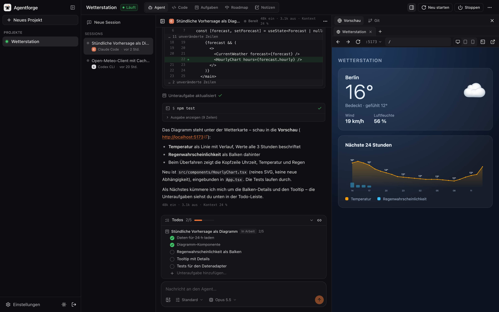
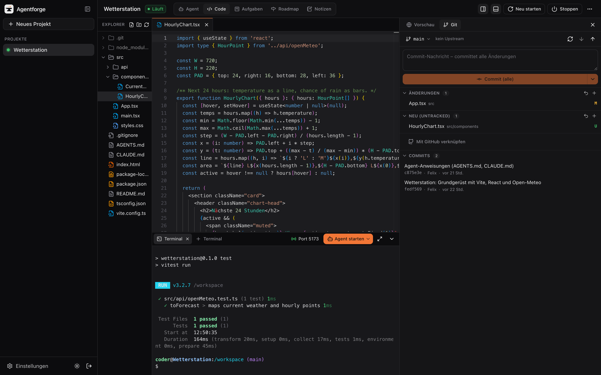
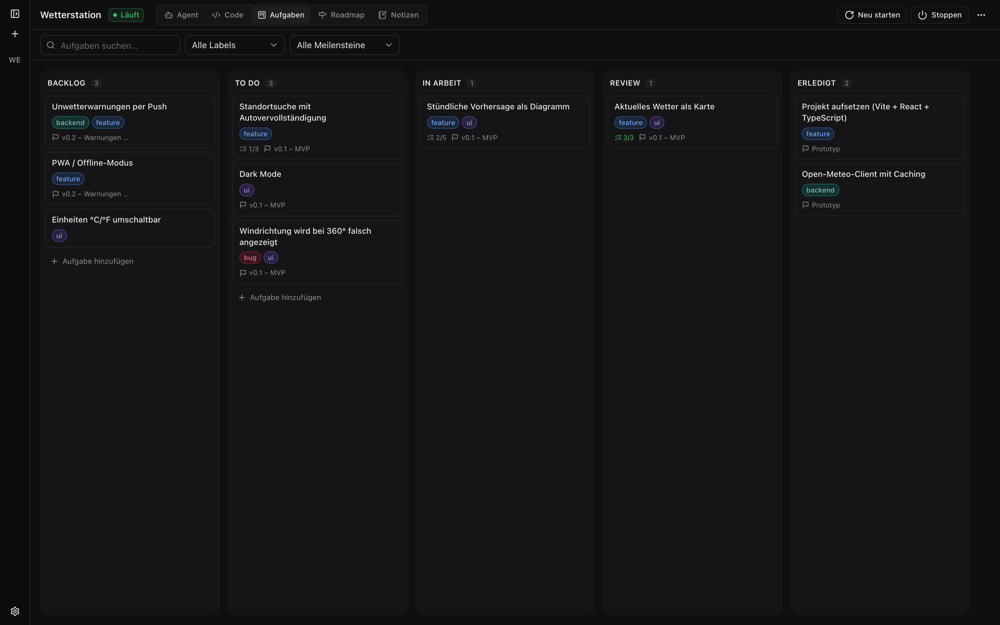
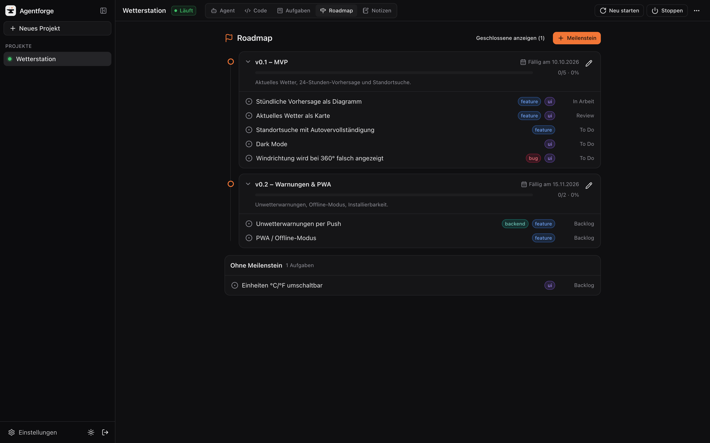
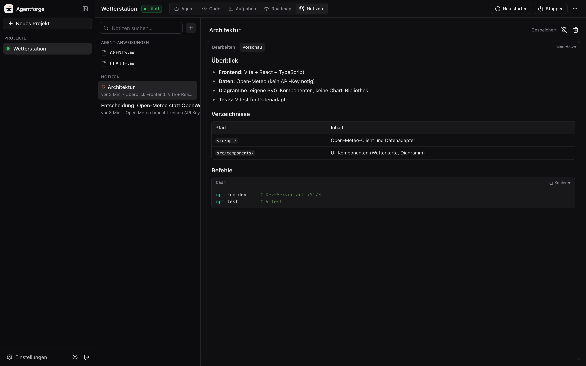
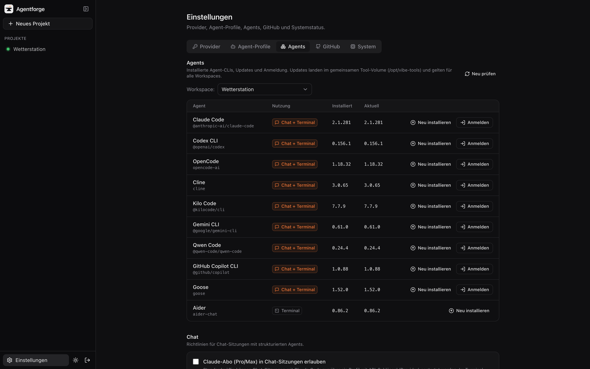
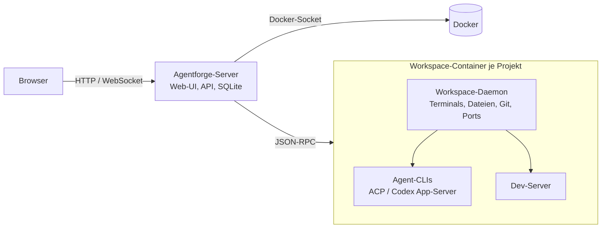

<p align="center">
  <picture>
    <source media="(prefers-color-scheme: dark)" srcset="docs/assets/logo-dark.svg">
    
  </picture>
</p>

<p align="center">
  <b>Die selbst gehostete Schmiede für Coding-Agents.</b><br>
  Claude Code, Codex, OpenCode, Cline, Kilo, Gemini, Qwen, Copilot, Goose und Aider in einer Web-Oberfläche –<br>
  jedes Projekt in einem eigenen, isolierten Workspace-Container.
</p>

<p align="center">
  <a href="#schnellstart">Schnellstart</a> ·
  <a href="docs/installation.md">Installation</a> ·
  <a href="unraid/README.md">Unraid</a> ·
  <a href="docs/security.md">Sicherheit</a> ·
  <a href="docs/api.md">API</a>
</p>



## Was ist Agentforge?

Agentforge ist eine Vibecoding-Plattform für den eigenen Server, das NAS oder den Rechner unter dem Schreibtisch.
Du legst ein Projekt an, Agentforge startet dafür einen Linux-Container mit kompletter Toolchain – und darin
arbeiten die Coding-Agents deiner Wahl. Du sprichst mit ihnen im Chat, siehst jede Dateiänderung als Diff, verfolgst
ihren Fortschritt auf einem Aufgaben-Board und schaust dir das Ergebnis direkt in der eingebauten Live-Vorschau an.

Alles läuft bei dir: Code, Logins und API-Schlüssel verlassen deinen Server nicht, und du kannst Agents per Abo-Login
oder mit eigenen API-Keys, OpenRouter oder lokalen Modellen über Ollama betreiben.

## Funktionen

### Agent-Chat

Ein Chat für alle Agents – egal ob Claude Code, Codex oder OpenCode. Agentforge spricht mit den Agents über ihre
strukturierten Schnittstellen ([Agent Client Protocol](https://agentclientprotocol.com), Codex App-Server) und zeigt
alles einheitlich an:

- Antworten mit Markdown, Denkprozess und Laufzeit
- Tool-Aufrufe als Karten: Befehle mit Ausgabe, Dateiänderungen als Diff, Sub-Agents verschachtelt
- **Freigaben** für Befehle und Dateiänderungen sowie **Rückfragen** des Agents mit Auswahlmöglichkeiten direkt im Chat
- **Todo-Leiste** über dem Eingabefeld: die Todo-Liste des Agents und die Unteraufgaben der Board-Aufgaben, an denen er arbeitet
- Modell- und Modus-Wahl je Sitzung, Token- und Kontextanzeige, Bilder im Prompt
- Sitzungen laufen im Workspace weiter, auch wenn der Browser zu ist

### Code, Terminal und Git



- **Editor** auf Basis von Monaco (VS Code) mit Dateibaum
- **Terminals** im Workspace – oder ein Agent direkt als TUI im Terminal (auch Aider und jeder Agent ohne Chat-Schnittstelle)
- **Git-Panel** mit Änderungen, Diffs, Commits, Branches und Worktrees
- **GitHub**: Repos verknüpfen oder direkt neu anlegen, Push/Pull ohne Token-Gefrickel, Pull Requests im Blick

### Live-Vorschau

Startet ein Agent (oder du) einen Dev-Server, erkennt Agentforge den Port automatisch und öffnet die App in einem
eingebauten Browser mit Tabs, Geräteansichten und Konsole. Links wie `http://localhost:5173` im Chat öffnen direkt die
Vorschau. Für Reverse Proxies gibt es neben Port-Weiterleitung auch Vorschau-Subdomains ([Details](docs/preview.md)).

### Aufgaben-Board



Ein Kanban-Board pro Projekt mit Labels, Meilensteinen und Unteraufgaben. Die Agents arbeiten über eigene
Board-Tools (MCP) damit: Sie lesen Aufgaben, legen neue an, zerlegen sie in Unteraufgaben und haken sie ab.

**Den Status pflegt ausschließlich der Agent.** Du legst Aufgaben an und priorisierst sie – verschoben, abgehakt und
geschlossen wird nur vom Agent. So zeigt das Board immer den tatsächlichen Stand der Arbeit.

Eine Aufgabe lässt sich per Klick an einen Agent übergeben: Er arbeitet dann in einem eigenen Git-Worktree auf einem
eigenen Branch, und auf Wunsch öffnet Agentforge am Ende automatisch einen Pull Request. Aufgaben können mit
GitHub-Issues synchronisiert werden.

### Roadmap und Notizen

<table>
  <tr>
    <td></td>
    <td></td>
  </tr>
</table>

- **Roadmap** mit Meilensteinen, Fälligkeiten und Fortschritt
- **Notizen** in Markdown für Entscheidungen, Architektur und Wissen – Agents lesen und schreiben sie ebenfalls
- **AGENTS.md / CLAUDE.md** direkt bearbeiten, inklusive einer Vorlage, die den Agents alles über ihre Umgebung erklärt

### Agents und Provider



- Alle Agent-CLIs sind im Workspace-Image vorinstalliert und lassen sich per Klick aktualisieren
- **Abo-Login** (z. B. Claude Pro/Max, ChatGPT, GitHub Copilot) einmal durchführen – gilt für alle Workspaces
- **Provider** für API-Keys, OpenRouter, OpenAI-/Anthropic-kompatible Endpunkte und Ollama; **Agent-Profile** kombinieren Agent, Provider und Modell
- Schlüssel werden verschlüsselt gespeichert und nur dem jeweiligen Agent-Prozess übergeben

## Unterstützte Agents

| Agent | Chat | Terminal |
|---|:---:|:---:|
| Claude Code | ✓ | ✓ |
| Codex CLI | ✓ | ✓ |
| OpenCode | ✓ | ✓ |
| Cline | ✓ | ✓ |
| Kilo Code | ✓ | ✓ |
| Gemini CLI | ✓ | ✓ |
| Qwen Code | ✓ | ✓ |
| GitHub Copilot CLI | ✓ | ✓ |
| Goose | ✓ | ✓ |
| Aider | – | ✓ |

Ein weiterer Agent ist ein Eintrag in [`packages/shared/src/agents.ts`](packages/shared/src/agents.ts).

## Workspaces

Jedes Projekt bekommt einen eigenen Container (Debian) mit:

- Node 22 (npm, pnpm, bun), Python 3.11 (pip, uv), git, GitHub CLI, ripgrep, jq, Build-Tools
- **Docker** mit eigenem Daemon – Agents können Container bauen und starten, ohne den Host-Docker zu sehen
- Chromium mit **Playwright-MCP**, damit Agents ihre Oberflächen selbst im Browser prüfen können
- CPU- und RAM-Limits pro Workspace, optionales automatisches Stoppen bei Inaktivität

Projektdateien, Agent-Logins, globale Tools und Paket-Caches liegen auf dem Host und überstehen Neustarts und Updates
des Workspace-Images.

## Schnellstart

Voraussetzung: Docker ≥ 24 auf Linux, Unraid oder Docker Desktop. Fertige Images gibt es für `amd64` und `arm64`.

```bash
git clone https://github.com/gottschalkfelix4-source/agentforge.git
cd agentforge/docker
cp ../.env.example .env
```

In `.env` mindestens setzen:

| Variable | Wert |
|---|---|
| `AGENTFORGE_SECRET_KEY` | Zufallswert, z. B. aus `openssl rand -hex 32` – verschlüsselt gespeicherte Schlüssel |
| `HOST_DATA_PATH` | Absoluter Pfad des Datenordners **auf dem Docker-Host**, z. B. `/opt/agentforge/docker/.data` |

```bash
docker compose pull
docker compose up -d
```

Danach `http://<host>:8080` öffnen. Beim ersten Start fragt Agentforge nach einem Setup-Token – er steht im Log
(`docker compose logs agentforge`) und in `.data/setup-token.txt`. Damit legst du dein Admin-Konto an.

Alles Weitere – Reverse Proxy (Nginx Proxy Manager, SWAG, Traefik), Vorschau-Subdomains, GitHub-Anbindung und Updates –
steht in der [Installationsanleitung](docs/installation.md). Für Unraid gibt es ein
[Community-Applications-Template](unraid/README.md).

## Aufbau



| Pfad | Inhalt |
|---|---|
| `apps/web` | Web-Oberfläche (React, Vite, Tailwind, Monaco, xterm.js) |
| `apps/server` | Server: Anmeldung, API, Docker-Orchestrierung, Board, GitHub, Vorschau |
| `packages/workspace-daemon` | Daemon im Workspace-Container: Terminals, Dateien, Git, Ports, Agent-Prozesse |
| `packages/agent-adapters` | Anbindung der Agents über ACP und den Codex App-Server |
| `packages/shared` | Gemeinsame Typen, Protokolle und Agent-Definitionen |
| `docker/`, `unraid/` | Images, Compose-Datei und Unraid-Template |

## Sicherheit

Agentforge braucht Zugriff auf den Docker-Socket, und Workspaces laufen privilegiert mit eigenem Docker-Daemon. Ein
Agent kann damit im Zweifel Root-Rechte auf dem Host erlangen. Betreibe Agentforge deshalb nur für dich bzw. vertraute
Nutzer und nicht offen im Internet – am besten hinter VPN oder einem Reverse Proxy mit Anmeldung.
Details und Empfehlungen: [docs/security.md](docs/security.md).

## Entwicklung

```bash
pnpm install
pnpm --filter @vibe/shared --filter @vibe/agent-adapters build
docker build -f docker/workspace/Dockerfile -t agentforge-workspace:dev .
pnpm --filter @vibe/server dev     # http://localhost:8787
pnpm --filter @vibe/web dev        # http://localhost:5180
```

Vor einem Commit: `pnpm typecheck`, `pnpm test` und `pnpm build`. Hinweise für Coding-Agents, die an Agentforge selbst
arbeiten, stehen in [docs/CONTRIBUTING-AGENTS.md](docs/CONTRIBUTING-AGENTS.md).

## Dokumentation

- [Installation und Betrieb](docs/installation.md)
- [Unraid](unraid/README.md)
- [Live-Vorschau](docs/preview.md)
- [Backup und Wiederherstellung](docs/backup.md)
- [Sicherheit](docs/security.md)
- [Fehlersuche](docs/troubleshooting.md)
- [API](docs/api.md)
